AWS Opsworks Provision Docker with Chef
======
The purpose of this article is to explain how to provision docker with the help of aws opsworks, the basic idea behind is to utilize chef recipes to spin up underneath ec2 and then pull docker image from AWS repository, and run docker over it.

##Create ECS Repository
First thing first, the first thing it to create repository to house docker images you need to work with. 
- Go to [ECS Console](https://console.aws.amazon.com/ecs/home), click **Repositories** on the navigation menu, and click **Get started** to start, as below: 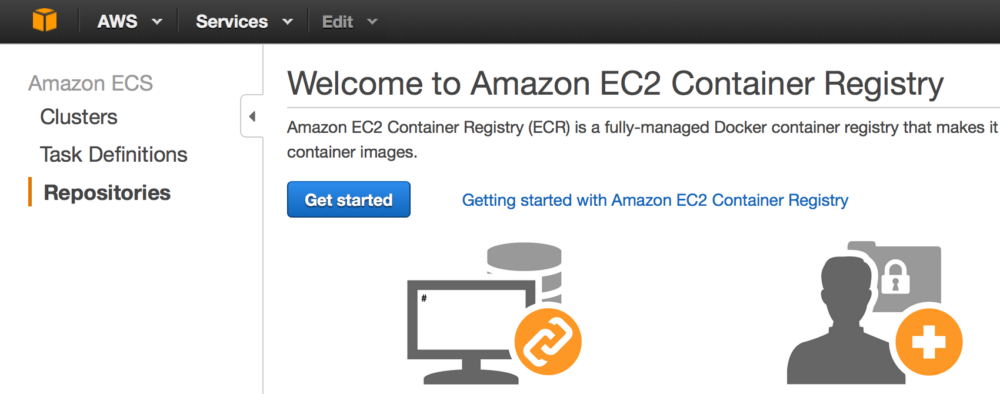

- Now it's time to set up name for your repositories, in this case we use 'my_rep' as repositories name, click **Next**  to proceed. 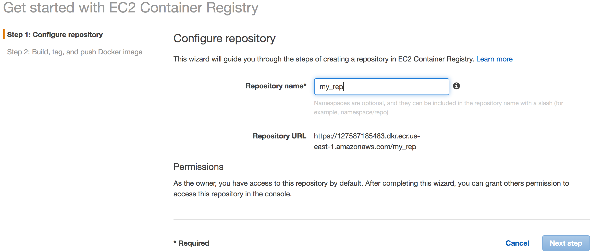

- Almost done, you are now presented with steps to **build, tag, and push Docker image**, please copy and paste the steps somewhere else and click "Done" to finish the process of repository creattion. 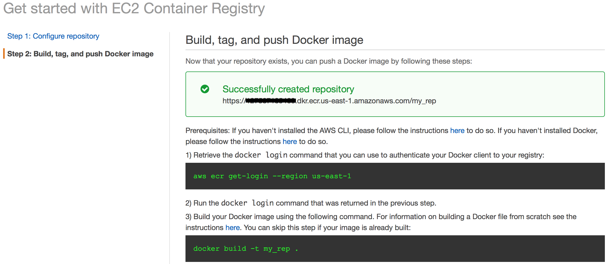

##Create Docker Image and Push to Repositories
So, you should follow the steps you just save to create and push image to repositories, but firstly you need to install aws cli and configure properly.
On how to do that, please go to [aws cli installation](http://docs.aws.amazon.com/cli/latest/userguide/installing.html).
- Run this command to retrieve login command for docker so that you can be authenticated to interact with AWS repositories. It will return the correct docker login command like below:
```bash
aws ecr get-login --region us-east-1

docker login -u AWS -p long_token_here -e none https://youaccountid.dkr.ecr.us-east-1.amazonaws.com
```
- Now, you should copy the docker command and run it.
```bash
docker login -u AWS -p long_token_here -e none https://youaccountid.dkr.ecr.us-east-1.amazonaws.com
``` 
If you don't want the hassle to do it twice, you can combine both commands into one command, like. Pay attention to the **`** mark used here.
```bash
`aws ecr get-login --region us-east-1`
```
You will see **Login Succeeded** message after command is run.
- So, we will take a simple nginx web app as example, dockfile as below.
```dockerfile
FROM ubuntu:12.04
RUN apt-get update
RUN apt-get install -y nginx zip curl

RUN echo "daemon off;" >> /etc/nginx/nginx.conf
RUN curl -o /usr/share/nginx/www/master.zip -L https://codeload.github.com/gabrielecirulli/2048/zip/master
RUN cd /usr/share/nginx/www/ && unzip master.zip && mv 2048-master/* . && rm -rf 2048-master master.zip

EXPOSE 80

CMD ["/usr/sbin/nginx", "-c", "/etc/nginx/nginx.conf"]
```
run command to build the image:
```bash
docker build -t my_rep .
```
If you see "Successfully built ......", you are done with image building.

- Tag your image so that you can push the image and differentiate it from the rest.
```bash
docker tag my_rep:latest youaccountid.dkr.ecr.us-east-1.amazonaws.com/my_rep:v1
```
- Now you should be able to push image to aws repositories, check console you can see your image is ready.
```bash
docker push youaccountid.dkr.ecr.us-east-1.amazonaws.com/my_rep:v1
```
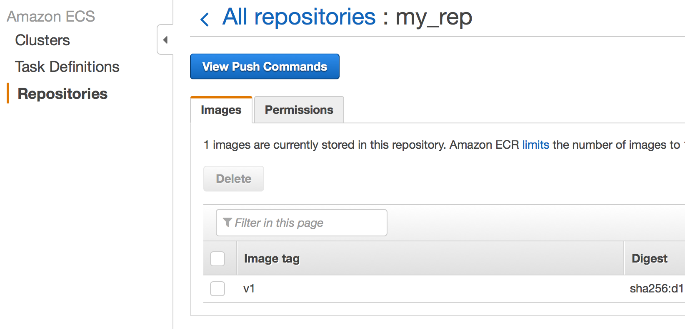

##Opsworks and Chef
Now, it's the real show of opsworks and chef here. 

###Create git repository for you cookbook
In order for opsworks to work as you expected, you need to cook your chef book and recipes and push to some public repository, like github, opswork will pull the chef recipes from the repository and run during the chef life cycle, like setup, configure, deploy, undeploy, shutdown. Please refer to [Git Repository Creation](https://help.github.com/articles/create-a-repo/) on how to create repository step by step.

Regarding the details of how cook book is build and how they work, it will be explained later.

###Create a stack of Opsworks
In this case, we will use **Chef 11.10**, and you need to specify **Stack name**, **Repository URL** which can be available from the git repository you just created.
After that , click **Add Stack** to create.
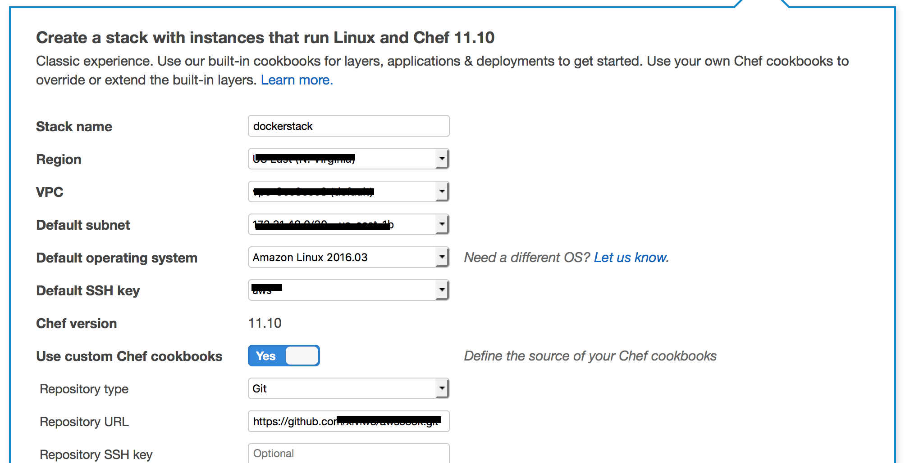

###Add a layer
Click **Add a Layer** on the coming up page, proceed to select **Custom** for **Layer type** , and **Docker** for **Name**, **docker** for **Short name**. Click **Add Layer** to finish.

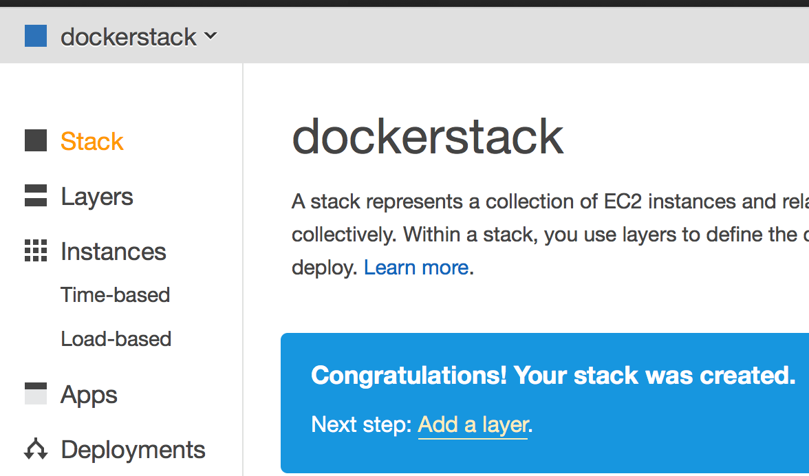

------------

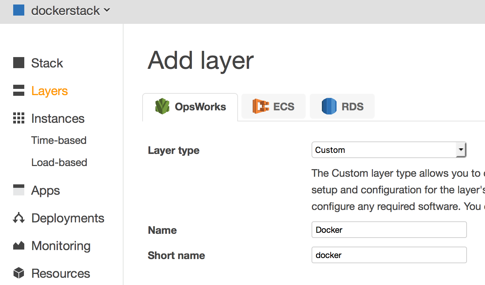

###Apply Chef Recipes to layer
- Click **Recipes** of **Docker** layer, which should present a page for you to match your chef recipes with the life cycle of chef. You will there are 18 built-in chef recipes defined for you by AWS.

------------


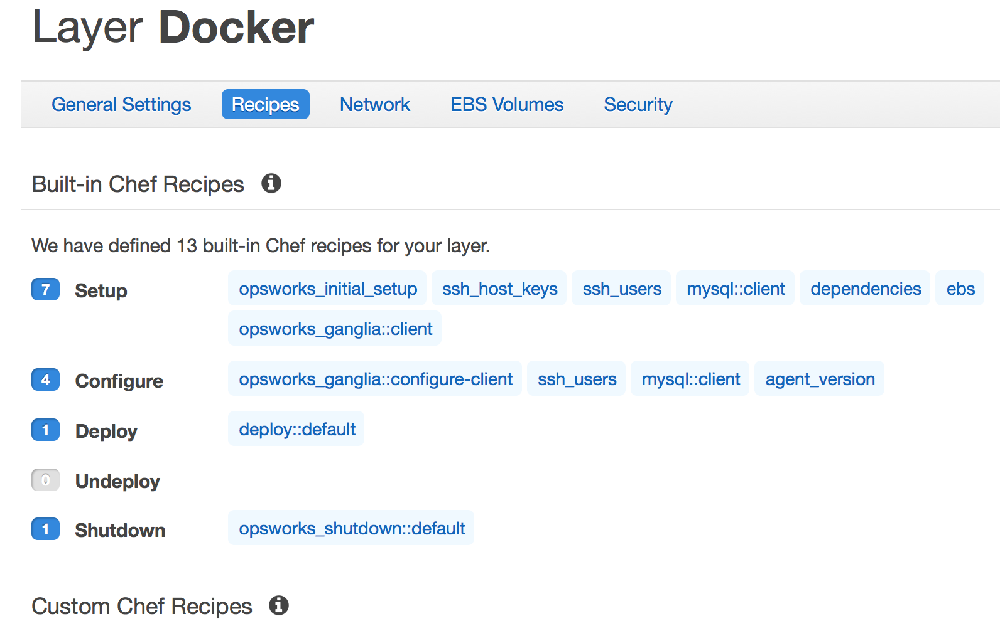


- Go to the **Custom Chef Recipes** part to edit your recipes corresponding to the ones in your gitbub cookbook repository, in our case for example as picture.
Input **awscook::install** for the **Setup** stage for example.

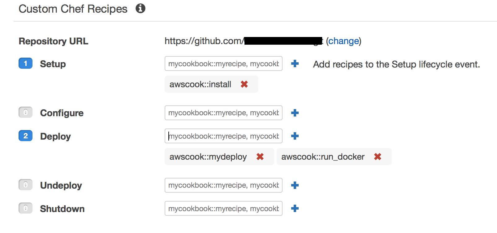

- So, let explain a little more about how to map input on the console to recipes on the Gitbub. 
For example:
**awscook::install** corresponds to **install.rb** in the github below,
**awscook::mydeploy** corresponds to **mydeploy.rb**  and **awscook** is the name of your cook book.

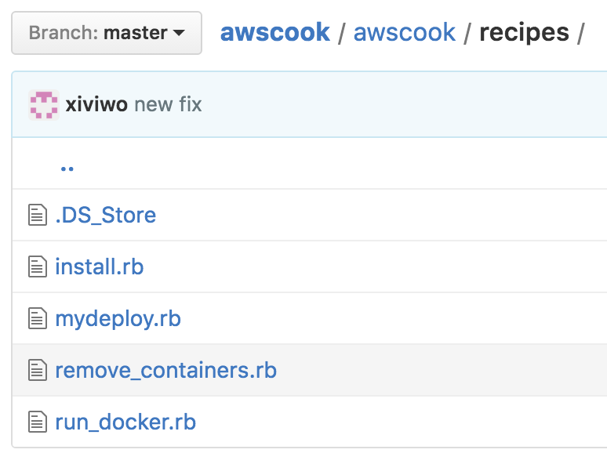

###Add Instances
- Ok, it's time to add instance to run your docker app. Click **Add an instance** in the following page  to add instance.

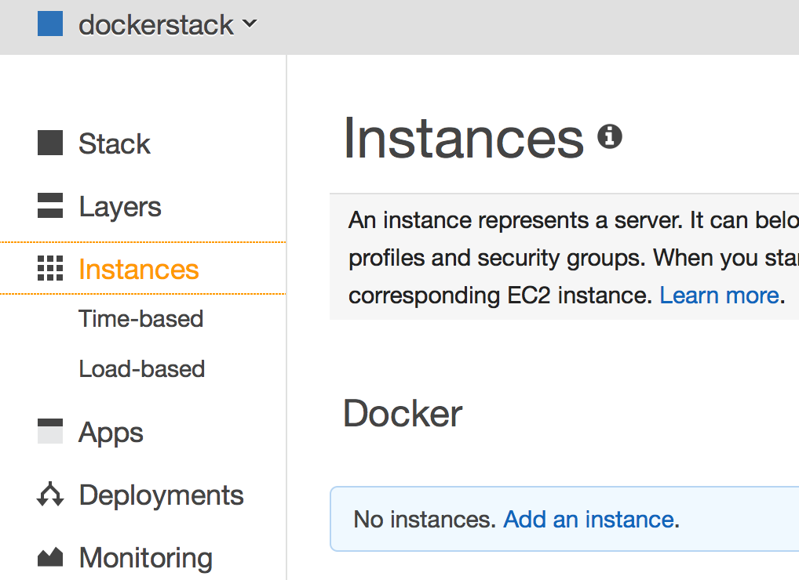


- Leave the default options and click **Add Instance**.


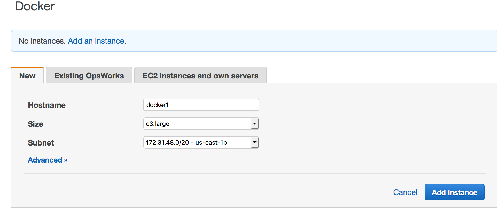

- Click **start** to launch your instance, if everything is OK, you will see the instance becomes **Online** status

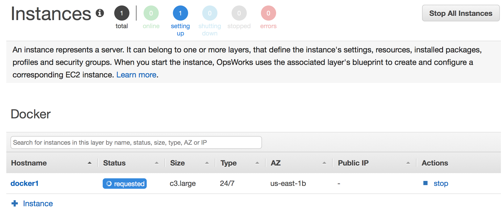

###Deploy Docker
- Navigate to **Deployment**, and click **Run command**.

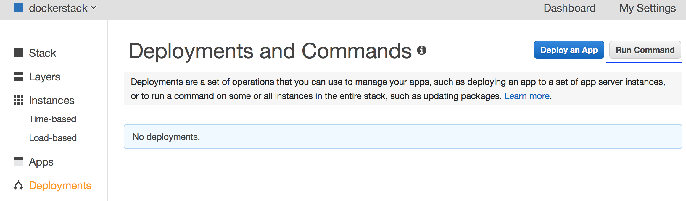

- Select **Execute Recipe** at **Command** and provide name of recipes to run at **Recipes to execute**. In our case, it's **awscook::mydeploy** and **awscook::run_docker**.  

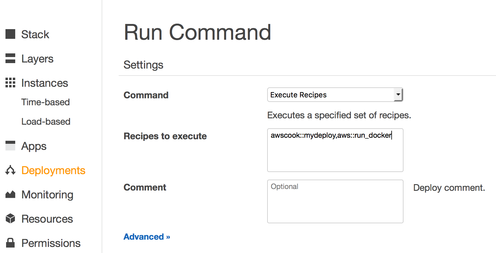

- After you docker is deployed, you should be present its status and IP, browser the IP, you will be seeing the docker app is up and running nicely. 


##Chef Recipes Explained
Here, I will explain the recipes involved in more details.


###Install.rb
The recipes is trying to install **docker** pacakge as well as **aws cli**. Why **aws cli** is needed here ? That is because you need to run aws cli command **aws ecr get-login --region us-east-1** to authenticate with aws repository and push and pull images from there. 
```ruby

docker_service 'default' do
  action [:create, :start]
end


include_recipe 'python::pip'

python_pip 'awscli' do

  action :install
end

```

###mydeploy.rb
This recipes is aimed to pull image from aws repository where we push built image to before. The command **aws ecr get-login** is vital to authenticate with aws firstly.
```ruby
# Pull my Nginx from AWS repo
script "pull_nginx_image" do  
  interpreter "bash"
  user "root"
  code <<-EOH
  export AWS_DEFAULT_REGION=#{node[:awscli][:region]}
    `aws ecr get-login --region #{node[:awscli][:region]}`
    docker pull #{node[:img][:name]}
  EOH
end 
```

###run_docker.rb
The code is simply to run the docker image just pulled
```ruby
# Run Nginx 
script "run_nginx_container" do  
  interpreter "bash"
  user "root"
  code <<-EOH

    docker run -p 80:80 --name=nginx -d ${default[:img][:name]}
  EOH
end
```

###remove_containers.rb
This recipes is intended to remove any docker containers, if system scales down.

```ruby

script "kill_all_containers" do  
  interpreter "ruby"
  user "root"
  code <<-EOH
    `docker ps -q`.split("\n").each do |container_id|
      `docker stop \#{container_id}`
    end
    `docker ps -a -q`.split("\n").each do |container_id|
      `docker rm \#{container_id}`
    end
  EOH
end  

```

##TODO
Working to meet all kinds of docker use scenario.

